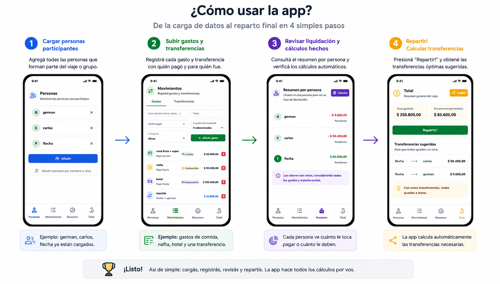

# Repartir gastos

Aplicación web estática para repartir cuentas entre varias personas. Sirve para viajes, comidas, salidas o cualquier gasto compartido donde alguien pagó por otras personas y después hay que liquidar saldos.

## Tutorial

## Qué permite hacer

- Agregar personas.
- Cargar gastos con monto, pagador y participantes.
- Registrar pagos realizados o devoluciones.
- Editar o eliminar movimientos.
- Ver resumen por persona: quién debe pagar y quién debe recibir.
- Calcular transferencias sugeridas para saldar la cuenta.
- Copiar el resumen final para compartirlo.

## Cómo funciona

Cada gasto se divide solo entre las personas que participaron. Por ejemplo, si una cena de $30.000 se divide entre Ana, Luis y Marta, a cada una le corresponde $10.000. Si Jorge no participó, Jorge no paga nada de esa cena.

Después la app compara dos cosas por persona:

- cuánto dinero puso;
- cuánto le tocaba pagar.

Si alguien puso más de lo que le tocaba, debe recibir plata. Si puso menos, debe pagar. Si puso justo lo suyo, está al día.

Los pagos ya realizados también cuentan. Si Ana ya le pagó a Luis, la deuda de Ana baja y Luis ya cobró una parte. Con todo eso, la app arma una lista simple de transferencias pendientes para que cada persona termine pagando exactamente su parte.

Los datos se guardan en el navegador con `localStorage`. No hay backend ni cuentas de usuario.
